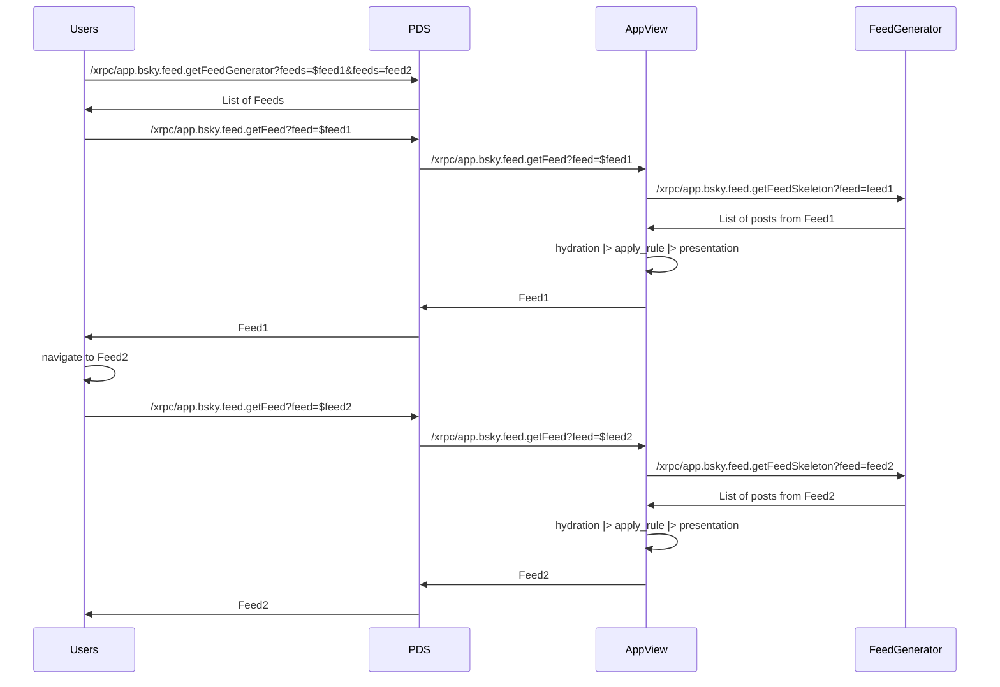

# feed_generator

this is [`bluesky-social/feed-generator`](https://github.com/bluesky-social/feed-generator) implementation written in Gleam. it's not feature complete yet as we don't do "ingest" anything yet, but at least it's a start!

this feed-generator is intended to be compatible with `app.bsky.feed.generator` as the only thing we (both) need is `feed.[i].post`.

also, this repo is intended for learning purposes despite the code running on discover.flooo.club

## how this feed thing works?

let's say we have these values:

- PDS: `https://at.flooo.club`
- Feed1: `at://did:web:flooo.club/app.bsky.feed.generator/discover`
- Feed2: `at://did:web:flooo.club/app.bsky.feed.generator/hot`

when users open the Bluesky Social app, the app will check their "saved feeds", loop through them, and send requests to `$pds/xrpc/app.bsky.feed.getFeedGenerator?feeds=$feed1&feeds=feed2`. the more feeds you save, the more requests you need. you already know that!

if you have 2 saved feeds, the app will eventually request:

- `$pds/xrpc/app.bsky.feed.getFeed?feed=$feed1`
- `$pds/xrpc/app.bsky.feed.getFeed?feed=$feed2`

when the PDS gets an `app.bsky.feed.getFeed` request from the app, the PDS (proxied through AppView?) will send a request to `$service/xrpc/app.bsky.getFeedSkeleton?feed=$feed` so the bluesky app view knows what posts should be displayed. but, how does your PDS know the `$service`?

when accessing `at://did:web:flooo.club/app.bsky.feed.generator/discover`, PDS knows there's a `did` record, for example, `did:web:discover.flooo.club`. PDS sends a request to `discover.flooo.club/well-known/did.json` and gets the value. the `$service` will likely check if the `feed` uri is generated by themselves and reject it when it's not.

so the flow is something like this:



feed_generator is responsible for giving the list of post uris based on certain algorithms

## the algorithm

if you want your feed to only show "any posts that were created 2 hours ago" the algorithm might be something like this:

```
db.select('uri').from('posts').where('created_at').lt(now() - '2 hours') // not real
```

for more advanced logic like "show only mutuals", maybe something like this:

```
let mutuals = followers.filter(follower => following.includes(follower)) // o(n*m)

db.select('uri').from('posts').where('author_did').in(mutuals) // not real too
```

the question is: where did we query to? in the `bluesky-social/feed-generator`, the generator listens to the firehose as usual but only stores it to the db if a post meets some conditions. you can also just store everything but only show what meets certain conditions.

## the disclaimer (for anyone stopping by)

this feed is for general use and not for individual users (so our "mutual" example may not work yet). but as a generator, this may change!

also, this feed is specifically built for flooo.club but i do maintain the "interoperability" for just in case (since the endpoint is only 2). this means, when the feed is built for `app.bsky.feed.generator`, it will show anything that's related to `app.bsky.feed`.
